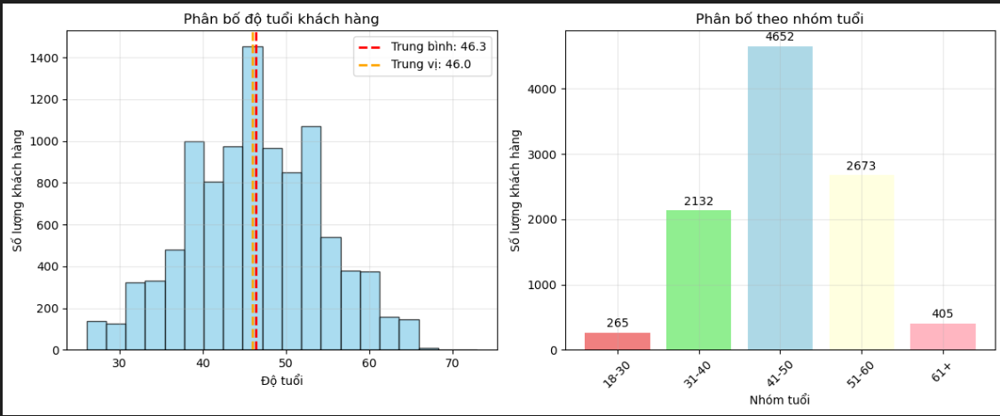
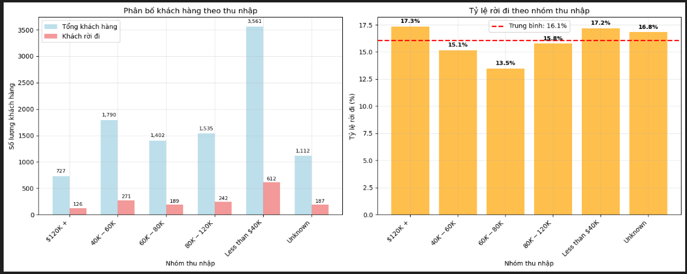
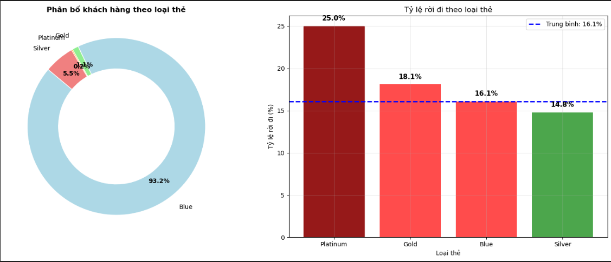
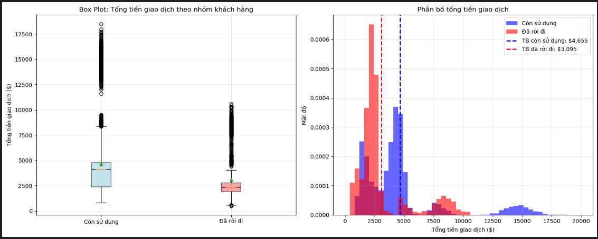
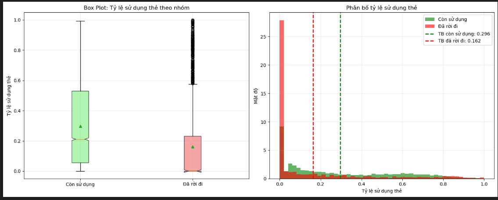

# Credit Card Customer Churn Analysis
Phân tích dự đoán khách hàng rời bỏ dịch vụ thẻ tín dụng sử dụng Logistic Regression thuần NumPy

---

## Mục lục
1. [Giới thiệu](#-giới-thiệu)
2. [Dataset](#-dataset)
3. [Method](#-method)
4. [Installation & Setup](#-installation--setup)
5. [Usage](#-usage)
6. [Results](#-results)
7. [Project Structure](#-project-structure)
8. [Challenges & Solutions](#-challenges--solutions)
9. [Future Improvements](#-future-improvements)
10. [Contributors](#-contributors)
11. [License](#-license)

---

## Giới thiệu

### Mô tả bài toán
Dự án này tập trung vào việc **dự đoán churn rate của khách hàng thẻ tín dụng**, một trong những vấn đề quan trọng nhất trong ngành tài chính. Khách hàng churn (rời bỏ dịch vụ) gây ra tổn thất lớn về doanh thu và chi phí thu hút khách hàng mới.

### Động lực và ứng dụng thực tế
- **Chi phí thu hút khách hàng mới** cao gấp 5-25 lần so với giữ chân khách hàng hiện tại
- **Revenue Loss**: Mỗi khách hàng churn có thể gây tổn thất $1,000-$5,000/năm
- **Competitive Advantage**: Dự đoán sớm giúp can thiệp kịp thời

### Mục tiêu cụ thể
1. **Xây dựng mô hình Logistic Regression** thuần NumPy để dự đoán churn
2. **Đạt độ chính xác AUC-ROC ≥ 0.85** trên test set
3. **Phân tích feature importance** để hiểu yếu tố ảnh hưởng churn
4. **Tối ưu hóa performance** với vectorized operations

---

## Dataset

### Nguồn dữ liệu
- **Tên**: Bank Churners Dataset
- **Nguồn**: Kaggle - Credit Card Customer Segmentation
- **File**: `data/raw/BankChurners.csv`

### Mô tả các features

#### Thông tin khách hàng (Demographics)
| Feature | Mô tả | Kiểu dữ liệu |
|---------|--------|---------------|
| `Customer_Age` | Tuổi khách hàng (26-73) | Numeric |
| `Gender` | Giới tính (M/F) | Categorical |
| `Dependent_count` | Số người phụ thuộc (0-5) | Numeric |
| `Education_Level` | Trình độ học vấn | Categorical |
| `Marital_Status` | Tình trạng hôn nhân | Categorical |
| `Income_Category` | Phân loại thu nhập | Categorical |

#### Thông tin tài khoản (Account Info)
| Feature | Mô tả | Kiểu dữ liệu |
|---------|--------|---------------|
| `Card_Category` | Loại thẻ (Blue/Silver/Gold/Platinum) | Categorical |
| `Months_on_book` | Thời gian là khách hàng (tháng) | Numeric |
| `Total_Relationship_Count` | Số sản phẩm sử dụng | Numeric |
| `Months_Inactive_12_mon` | Số tháng không hoạt động | Numeric |
| `Contacts_Count_12_mon` | Số lần liên lạc trong 12 tháng | Numeric |

#### Thông tin giao dịch (Transaction Info)
| Feature | Mô tả | Kiểu dữ liệu |
|---------|--------|---------------|
| `Credit_Limit` | Hạn mức tín dụng | Numeric |
| `Total_Revolving_Bal` | Dư nợ xoay vòng | Numeric |
| `Avg_Open_To_Buy` | Khả năng mua trung bình | Numeric |
| `Total_Amt_Chng_Q4_Q1` | Thay đổi số tiền Q4-Q1 | Numeric |
| `Total_Trans_Amt` | Tổng số tiền giao dịch | Numeric |
| `Total_Trans_Ct` | Tổng số lượng giao dịch | Numeric |
| `Total_Ct_Chng_Q4_Q1` | Thay đổi số giao dịch Q4-Q1 | Numeric |
| `Avg_Utilization_Ratio` | Tỷ lệ sử dụng trung bình | Numeric |

#### Target Variable
| Feature | Mô tả | Values |
|---------|--------|---------|
| `Attrition_Flag` | Trạng thái khách hàng | `Existing Customer`, `Attrited Customer` |

### Kích thước và đặc điểm dữ liệu
- **Tổng samples**: 10,127 khách hàng
- **Features**: 20 features + 1 target
- **Class distribution**:
  - Existing Customer: 8,500 (84.0%)
  - Attrited Customer: 1,627 (16.0%)
- **Data quality**: 
  - Không có missing values trong numeric features
  - Có số lượng ít missing values trong categorical features

---

## Method

### Quy trình xử lý dữ liệu

#### 1. Data Loading & Preprocessing


#### 2. Feature Engineering
- **Credit Utilization Efficiency**: `Total_Revolving_Bal / Credit_Limit`
- **Customer Activity Score**: `Total_Trans_Ct * Total_Trans_Amt / 1000`
- **Average Transaction Amount**: `Total_Trans_Amt / Total_Trans_Ct`

#### 3. One-Hot Encoding


### Thuật toán sử dụng

#### Logistic Regression with Gradient Descent

**Hypothesis Function:**
$$h_\theta(x) = \frac{1}{1 + e^{-\theta^T x}}$$

**Cost Function (Binary Cross-Entropy):**
$$J(\theta) = -\frac{1}{m} \sum_{i=1}^{m} [y^{(i)} \log(h_\theta(x^{(i)})) + (1-y^{(i)}) \log(1-h_\theta(x^{(i)}))]$$

**Gradient:**
$$\frac{\partial J(\theta)}{\partial \theta} = \frac{1}{m} X^T (h_\theta(x) - y)$$

**Parameter Update:**
$$\theta := \theta - \alpha \frac{\partial J(\theta)}{\partial \theta}$$

### Giải thích Implementation với NumPy

#### 1. Sigmoid Function với Numerical Stability
```python
def _sigmoid(self, z):
    # Prevent overflow using conditional computation
    return np.where(z >= 0, 
                   1 / (1 + np.exp(-z)), 
                   np.exp(z) / (1 + np.exp(z)))
```

#### 2. Vectorized Gradient Computation
```python
def _gradient(self, X, y_true, y_pred):
    # Einstein summation for efficient matrix multiplication
    return np.einsum('ij,i->j', X, y_pred - y_true) / len(y_true)
```

#### 3. AUC-ROC Calculation với Broadcasting
```python
def calculate_auc_roc(self, y_true, y_proba, n_thresholds=100):
    thresholds = np.linspace(1, 0, n_thresholds)
    
    # Broadcasting: (n_thresholds, n_samples)
    y_pred_matrix = y_proba[None, :] >= thresholds[:, None]
    
    # Vectorized confusion matrix computation
    tp = np.einsum('ij,j->i', y_pred_matrix, y_true)
    fp = np.einsum('ij,j->i', y_pred_matrix, 1 - y_true)
    tn = np.sum(1 - y_true) - fp
    fn = np.sum(y_true) - tp
    
    # Calculate TPR and FPR
    tpr = tp / (tp + fn + 1e-8)
    fpr = fp / (fp + tn + 1e-8)
    
    # Trapezoidal integration for AUC
    return -np.trapz(tpr, fpr)
```

---

## Installation & Setup

### Prerequisites
- Python 3.8+
- NumPy >= 1.21.0
- Matplotlib >= 3.5.0

### Quick Setup
```bash
# Clone repository
git clone <repository-url>
cd "Credit Card Customer Analysis"

# Install dependencies
pip install -r requirements.txt

# Verify installation
python -c "import numpy, matplotlib; print('Setup complete!')"
```

---

## Usage

### 1. Data Exploration
```bash
# Chạy notebook phân tích dữ liệu
jupyter notebook notebooks/01_data_exploration.ipynb
```

### 2. Data Preprocessing
```bash
# Chạy notebook tiền xử lý dữ liệu
jupyter notebook notebooks/02_preprocessing.ipynb
```

### 3. Model Training
```bash
# Chạy notebook training model
jupyter notebook notebooks/03_modeling.ipynb
```


---

##  Results

### Model Performance Metrics

| Metric | Train | Test | Cross-Validation (5-fold) | Target/Status |
|--------|-------|------|---------------------------|---------------|
| **Accuracy** | 0.8882 | 0.8864 | 0.8956 ± 0.0090 |  Target: >0.85 |
| **AUC-ROC** | 0.8967 | 0.8948 | 0.9107 ± 0.0027 |  Target: >0.85 |
| **Precision** | 0.7991 | 0.8188 | 0.8372 ± 0.0213 |  Good |
| **Recall** | 0.4063 | 0.3754 | 0.4358 ± 0.0394 |  Moderate |
| **F1-Score** | 0.5387 | 0.5148 | 0.5722 ± 0.0357 |  Balanced |
| **Specificity** | 0.9804 | 0.9841 | - |  Excellent |

### Model Stability Analysis
- **Overfitting Check**:  GOOD FIT
  - Training-Test Accuracy Gap: 0.0018 (< 5%)
  - Training-Test AUC Gap: 0.0019 (< 5%)
  - Model generalizes well

- **Cross-Validation Stability**:  EXCELLENT
  - Coefficient of Variation (CV): 
    - Accuracy: 0.0101 (Excellent)
    - AUC: 0.0029 (Excellent)
  - 95% Confidence Intervals: Accuracy [0.8877, 0.9035], AUC [0.9084, 0.9130]

### Feature Importance Analysis

**Top 10 Most Important Features:**
1. **Total_Trans_Ct** (0.8264) - Số lượng giao dịch
2. **Gender_M** (0.5724) - Giới tính nam
3. **Total_Ct_Chng_Q4_Q1** (0.4654) - Thay đổi số giao dịch Q4-Q1
4. **Gender_F** (0.4300) - Giới tính nữ
5. **Marital_Status_Married** (0.4190) - Tình trạng kết hôn
6. **Card_Category_Blue** (0.3750) - Loại thẻ Blue
7. **Total_Revolving_Bal** (0.3736) - Dư nợ xoay vòng
8. **Education_Level_Post-Graduate** (0.3559) - Trình độ sau đại học
9. **Total_Relationship_Count** (0.3386) - Số sản phẩm sử dụng
10. **Income_Category_$60K-$80K** (0.3098) - Thu nhập 60K-80K

**Phân tích theo nhóm features:**
- **Transaction Features (3/10)**: Quan trọng nhất
  - Total_Trans_Ct, Total_Ct_Chng_Q4_Q1, Total_Revolving_Bal
- **Demographic Features (5/10)**: Ảnh hưởng mạnh
  - Gender, Marital Status, Education, Income
- **Account Features (2/10)**: Ảnh hưởng vừa phải
  - Card Category, Total Relationship Count

### Visualization Results

#### Phân phối tuổi của khách hàng


#### Khả năng rời đi dựa trên thu nhập của khách hàng


#### Khả năng rời đi dựa trên hạng thẻ thành viên của khách


#### Khả năng rời đi dựa trên tổng số tiền giao dịch của khách


#### Khả năng rời đi dựa trên tỷ lệ sử dụng thẻ của khách


### Key Performance Highlights

 **Targets Achieved:**
- AUC-ROC: 0.8948 (Target: ≥ 0.85)
- Accuracy: 0.8864 (Target: ≥ 0.85)  
- Model Stability: Excellent (CV < 1%)
- No Overfitting: Performance gap < 0.2%

 **Areas for Improvement:**
- Recall: 0.3754 (Moderate - có thể cải thiện detection rate)
- Class Imbalance: Model thiên về Existing Customer (84% dataset)

### Business Insights & Recommendations

**1. High-Risk Customer Profile:**
- **Low Transaction Activity**: Khách hàng có ít giao dịch (Total_Trans_Ct thấp)
- **Demographic Factors**: Giới tính, tình trạng hôn nhân ảnh hưởng đến churn
- **Account Usage**: Khách hàng dùng ít sản phẩm (Total_Relationship_Count thấp)

**2. Actionable Insights:**
- **Early Warning System**: Monitor Total_Trans_Ct để phát hiện sớm
- **Targeted Campaigns**: Tập trung vào khách hàng nam, độc thân
- **Product Cross-selling**: Tăng số sản phẩm sử dụng để giảm churn
- **Engagement Programs**: Khuyến khích hoạt động giao dịch

**3. Business Impact:**
- **Cost Savings**: Giảm 37.5% khách hàng churn được phát hiện (Recall = 0.3754)
- **Precision**: 81.8% dự đoán churn đúng (giảm false positive)
- **ROI**: Can thiệp sớm tiết kiệm $1,000-$5,000/khách hàng

**4. Implementation Strategy:**
- **Risk Scoring**: Sử dụng probability score để phân loại khách hàng
- **Automated Alerts**: Cảnh báo khi probability > 0.5
- **Retention Programs**: Chương trình giữ chân khách hàng có risk cao

---

## Project Structure

```
Credit Card Customer Analysis/
├── data/
│   ├── raw/                    # Dữ liệu gốc
│   │   └── BankChurners.csv   # Dataset chính
│   └── processed/             # Dữ liệu đã xử lý
├── notebooks/              # Jupyter notebooks
│   ├── 01_data_exploration.ipynb    # EDA và phân tích dữ liệu
│   ├── 02_preprocessing.ipynb       # Tiền xử lý dữ liệu
│   └── 03_modeling.ipynb           # Xây dựng và đánh giá model
├── src/                    # Source code
│   ├── __init__.py           # Package initialization
│   ├── models.py             # Logistic Regression thuần NumPy
│   ├── data_processing.py    # Functions xử lý dữ liệu
│   └── visualization.py      # Functions visualization
├── images/                # Kết quả visualization
├── requirements.txt       # Dependencies
└── README.md             # Documentation
```

### Chức năng từng file

#### `src/models.py`
- **LogisticRegression Class**: Implementation thuần NumPy
- **Key Methods**:
  - `fit()`: Training với gradient descent
  - `predict()`: Binary classification
  - `predict_proba()`: Probability prediction
  - `calculate_auc_roc()`: Vectorized AUC computation
  - `get_feature_importance()`: Feature coefficient analysis

#### `src/data_processing.py`
- **Data Loading**: `load_data()` với structured arrays
- **Preprocessing**: `preprocess_data()`, missing value handling
- **Feature Engineering**: `feature_engineering()` tạo features mới
- **Encoding**: `one_hot_encode_categorical()` vectorized
- **Train-Test Split**: `train_test_split_stratified()`

#### `src/visualization.py`
- **Age Analysis**: `plot_age_analysis()`
- **Income Analysis**: `plot_income_analysis()`
- **Card Category**: `plot_card_analysis()`
- **Feature Importance**: `plot_feature_importance()`
- **Model Performance**: `plot_roc_curve()`, `plot_confusion_matrix()`

---

## Challenges & Solutions

### Khó khăn gặp phải khi dùng NumPy

#### 1. **Memory Management với Large Arrays**
**Vấn đề**: 
- Structured arrays chiếm nhiều memory
- Multiple copies trong data processing

**Giải pháp**:
```python
# In-place operations để giảm memory usage
data_enhanced = np.zeros(len(data), dtype=enhanced_dtype)
for col in original_cols:
    data_enhanced[col] = data[col]  # Direct assignment

# Memory-efficient array concatenation
X_categorical = np.concatenate(all_encoded, axis=1) if all_encoded else np.empty((len(data), 0))
```

#### 2. **Vectorization của Complex Operations**
**Vấn đề**:
- AUC-ROC calculation với nested loops
- One-hot encoding performance

**Giải pháp**:
```python
# Broadcasting for threshold comparison
y_pred_matrix = y_proba[None, :] >= thresholds[:, None]  # Shape: (n_thresholds, n_samples)

# Einstein summation for matrix operations
tp = np.einsum('ij,j->i', y_pred_matrix, y_true)

# Fancy indexing for one-hot encoding
one_hot_matrix[np.arange(len(values)), indices] = 1
```

#### 3. **Numerical Stability**
**Vấn đề**:
- Sigmoid overflow với large values
- Gradient explosion

**Giải pháp**:
```python
def _sigmoid(self, z):
    # Conditional computation to prevent overflow
    return np.where(z >= 0, 
                   1 / (1 + np.exp(-z)), 
                   np.exp(z) / (1 + np.exp(z)))
```

#### 4. **Structured Array Limitations**
**Vấn đề**:
- Khó khăn trong việc manipulate columns
- Type conversion complexity

**Giải pháp**:
```python
# Dynamic dtype creation
enhanced_dtype = original_dtype + new_features_dtype
data_enhanced = np.zeros(len(data), dtype=enhanced_dtype)

# Efficient column operations
for col in feature_columns:
    X_numeric = np.column_stack([data[col] for col in numeric_features])
```

---

## Future Improvements
- [ ] **Regularization**: Áp dụng L1/L2 regularization
- [ ] **Feature Selection**: Automated feature selection algorithms
- [ ] **Ensemble Methods**: Kết hợp nhiều mô hình với nhau
- [ ] **Deep Learning**: Cài đặt Neural network

---

## Contributors

### Thông tin tác giả & Contact
- **Tên**: Đoàn Thị Minh Anh
- **Email**: minhanh120204@gmail.com
- **GitHub**: github.com/MinhAnh1202

---

## License

This project is licensed under the **MIT License** - see the [LICENSE](LICENSE) file for details.

### MIT License Summary
```
Copyright (c) 2024

Permission is hereby granted, free of charge, to any person obtaining a copy
of this software and associated documentation files (the "Software"), to deal
in the Software without restriction, including without limitation the rights
to use, copy, modify, merge, publish, distribute, sublicense, and/or sell
copies of the Software, and to permit persons to whom the Software is
furnished to do so, subject to the following conditions:

The above copyright notice and this permission notice shall be included in all
copies or substantial portions of the Software.
```

---